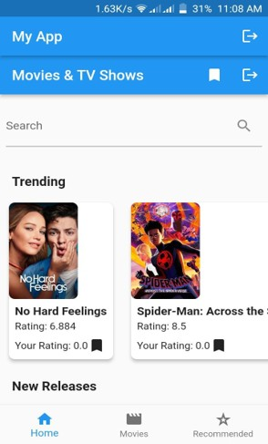
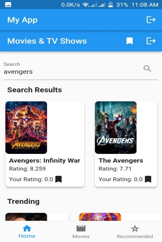
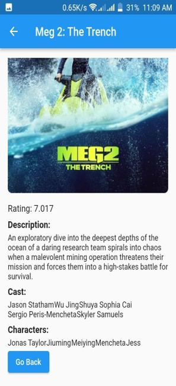
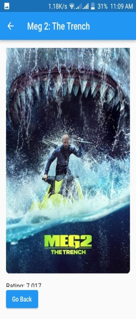
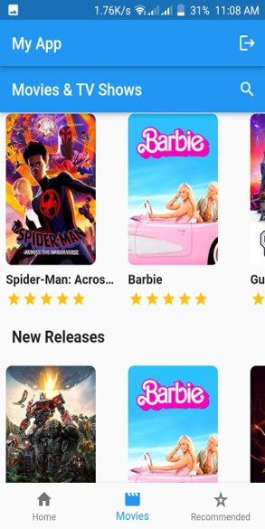
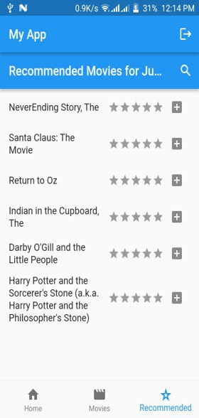
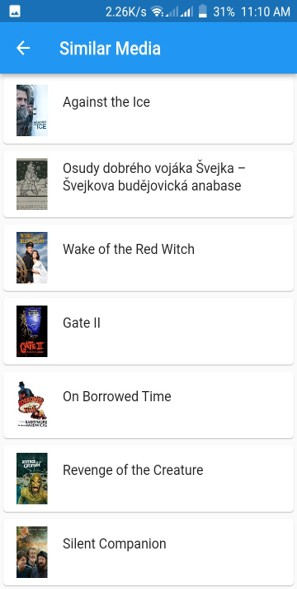
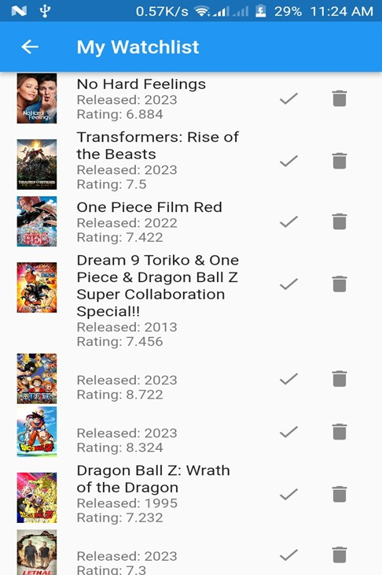

# Hybrid Movie Recommender App

A full-stack Flutter movie recommendation application that combines **content-based filtering** and **collaborative filtering** techniques to deliver personalized movie recommendations.

The application integrates data from the MovieLens dataset together with live movie metadata from TMDB to provide an interactive movie discovery experience.

---

## Features

- Hybrid recommendation engine
- Content-based filtering using TF-IDF and cosine similarity
- Collaborative filtering using user ratings
- Firebase authentication and user management
- Movie search powered by TMDB API
- Trending, upcoming, and recommended movies
- Personalized recommendations
- Movie rating system
- Watchlist functionality
- Fast REST API backend
- Firebase Remote Config integration

---

## Tech Stack

### Frontend
- Flutter
- Dart

### Backend
- Python
- FastAPI

### Machine Learning / Recommendation System
- Pandas
- Scikit-learn
- TF-IDF Vectorizer
- Cosine Similarity
- Pearson Correlation

### Database & Services
- Firebase Authentication
- Cloud Firestore
- Firebase Remote Config

### APIs & Dataset
- TMDB API
- MovieLens Latest Small Dataset

---

## Recommendation System Architecture

The recommendation engine combines:

### Content-Based Filtering

Movies are recommended based on genre similarity using TF-IDF vectorization and cosine similarity calculations.

### Collaborative Filtering

Recommendations are generated using user-item interactions and rating similarities between users.

### Hybrid Recommendation Model

The final recommendation score combines both content-based and collaborative filtering outputs to improve personalization and recommendation accuracy.

---

## Application Flow

1. User creates an account or logs in
2. Movies are fetched from TMDB
3. User searches or rates movies
4. Fast API processes recommendation requests
5. Hybrid recommendation engine generates personalized suggestions
6. Results are displayed in the Flutter application

---

## Dataset

The recommendation engine uses the MovieLens Latest Small dataset, including:

- movies.csv
- ratings.csv
- links.csv
- tags.csv

---

## Screenshots

  
  

  
  

  
  

  
  

---

## Limitations

- Backend server was hosted locally during development
- Watchlist persistence was partially implemented
- Android-focused implementation
- Recommendation quality limited by dataset size

---

## Future Improvements

- Deploy FastAPI backend to cloud platforms
- Improve watchlist synchronization
- Add iOS and Web support
- Improve recommendation ranking algorithms
- Docker support
- Advanced deep learning recommendation models

---

## Author

**Chris Ngatia**

